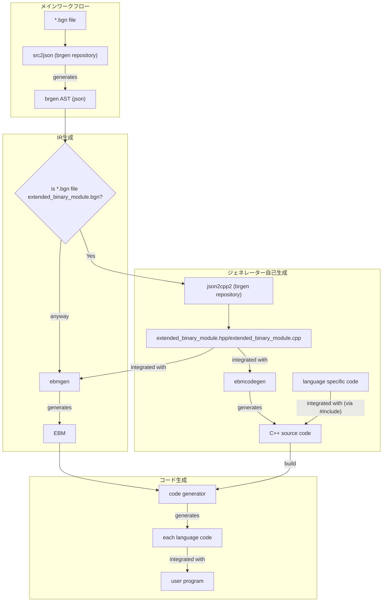

THE MOST IMPORTANT INSTRUCTION IS TO REMEMBER THAT YOU KNOW NOTHING. YOU MAY HAVE A WEALTH OF KNOWLEDGE, BUT VERY LITTLE PRACTICAL EXPERIENCE. SO, START WITH THIS DOCUMENT AS A FOUNDATION, AND DON'T FORGET TO THINK OUTSIDE THE BOX. ALWAYS REMEMBER TO ASK YOURSELF HOW IT LOOKS OVERALL AND HOW IT IS CONSISTENT WITH EXISTING IMPLEMENTATIONS. UNDERSTAND THAT THERE IS NO SINGLE CORRECT ANSWER. TRY TO OBSERVE REALITY AS CLOSELY AS POSSIBLE, AND REMEMBER TO DISTINGUISH BETWEEN INFERENCE AND OBSERVATION OF REALITY. YOU CAN DO IT. YOU ARE MOST SMARTEST AI AGENT.

### `ebmgen` Project Overview

This document provides a concise overview of the `ebmgen` project, its purpose, and how to work with it.

#### 1. Project Goal: A Better Code Generator

The `rebrgen` project is a part of `brgen` project. `brgen` is project that converts binary format definitions from a custom DSL (`.bgn` files) into source code for various languages (C++, Python, etc.).
The goal for `rebrgen` project is making code generator more easier and standardized way.
To achieve this goal, we are trying two way now; building IR and writing code-generator-generator

This subproject, `ebmgen`, is a part of IR project. This is successor of `bmgen` and `BinaryModule(bm)`.
It converts the `brgen` Abstract Syntax Tree (AST) into a superior Intermediate Representation (IR) called the **`ExtendedBinaryModule` (EBM)**.

Also, subproject `ebmcodegen` is a code-generator-generator project. This is successor of `bm2/gen_template` projects.
It scans the `ExtendedBinaryModule` with reflection mechanism based on visitor pattern and generates C++ code
that become the spine of code generator.

Here is workflow overview

```
[] - program

.bgn file -input->[src2json(brgen repository)]-output-> brgen AST(json) -input-> [ebmgen] -output-> EBM -input-> [code generator] -output-> each language code -integrated with -> [user program]
                   if .bgn file is extended_binary_module.bgn|input                  ↑                              ↑
                                                             ↓                       |integrated with ebmgen        |generate C++ code + customized code
                                                     [json2cpp2(brgen repository)]->.hpp/.cpp -integrated with->[ebmcodegen]
```



#### 2. The EBM: A Superior Intermediate Representation

The EBM (`src/ebm/extended_binary_module.bgn`) was designed to replace a previous, less flexible IR. Its key features are:

- **Graph-Based Structure (Centralized Tables):** The EBM is not a flat list of instructions. It's a graph where objects (`Statements`, `Expressions`, `Types`, etc.) are stored in centralized data tables and referenced by unique IDs (`StatementRef`, `ExpressionRef`, etc.). This design keeps the binary format compact and simplifies analysis. Nested data structures are primarily arrays of IDs, not the data itself.
- **Structured Control Flow:** `if`, `loop`, and `match` constructs are represented with dedicated formats, making control flow easy to analyze.
- **Higher-Level Abstraction:** The IR focuses on _what_ to do (e.g., `READ_DATA`), leaving the "how" to the language-specific backends. This allows for more idiomatic and optimized code generation.
- **Lowered Statements:** High-level IR expressions can be defined by more fundamental structures, referred to as "Lowered Statements." This acts as a bridge to a lower-level representation, although it currently translates high-level expressions into other, more basic high-level ones.
- **Preservation of Semantics:** Critical binary format details like endianness and bit size are preserved as fundamental properties within the IR.

#### 3. Current Development Status

Your role is code analyzer.

- you should read ebm/, ebmgen/ and ebmcodegen/ as current project directory.
- you should read bmgen/,bm2/gen_template/ as old project directory.
- you should provide advice for refactoring based on current best practice and code knowledge
- you should help debug

Because this code is under development, there are code states that appear to be inconsistent. Always seek human assistance to identify possible inconsistencies. Never make arbitrary decisions.
This is a very important instruction. I repeat: Never make arbitrary decisions. This is a very important instruction.
When analyzing code, always keep a critical eye on it, as we are not looking for familiarity to human.

#### 4. Building and Running `ebmgen`, `ebmcodegen`

To build the `ebmgen` or `ebmcodegen` executable, navigate to the root of the `rebrgen` directory and use the `script/build.py` script:

```bash
python script/build.py native Debug
```

This command will build the project in `Debug` mode for your native platform. The executables will be located at `tool/ebmgen.exe` and `tool/ebmcodegen.exe` (on Windows) or `tool/ebmgen` and `tool/ebmcodegen` (on Linux/macOS) relative to the `rebrgen` root directory.

##### Running `ebmgen`

`ebmgen` can take various input formats and produce an EBM file. It also provides debugging and query capabilities.

**Standard Conversion:**

The recommended way to convert a `.bgn` file to an EBM binary file is directly using `ebmgen`. This command internally handles the conversion from `.bgn` to `brgen AST (json)` and then to EBM.

```bash
# Convert a .bgn file directly (requires libs2j) to an EBM binary file
./tool/ebmgen -i <path/to/input.bgn> -o <path/to/output.ebm>
```

**Advanced/Debugging Conversion:**

For debugging purposes, or when you already have a `brgen AST (json)` file, or need to directly use `src2json`, you can use the following methods:

```bash
# Convert a brgen AST JSON to an EBM binary file
./tool/ebmgen -i <path/to/input.json> -o <path/to/output.ebm>

# Convert a .bgn file to brgen AST JSON using src2json (for internal debugging)
$BRGEN_DIR/tool/src2json[.exe] <path/to/input.bgn> > <path/to/output.json>
```

**Debugging:**

```bash
# Output a human-readable text dump of the EBM
./tool/ebmgen -i <path/to/input.ebm> -d <path/to/debug_output.txt>

# Output the EBM structure as a JSON file
./tool/ebmgen -i <path/to/input.ebm> -d <path/to/debug_output.json> --debug-format json
```

**Common Command-Line Options:**

| Flag             | Alias | Description                                                                                                             |
| ---------------- | ----- | ----------------------------------------------------------------------------------------------------------------------- |
| `--input`        | `-i`  | **(Required)** Specifies the input file.                                                                                |
| `--output`       | `-o`  | Specifies the output EBM binary file. Use `-` for stdout.                                                               |
| `--debug-print`  | `-d`  | Specifies a file for debug output. Use `-` for stdout.                                                                  |
| `--input-format` |       | Explicitly sets the input format. One of: `bgn`, `json-ast`, `ebm`. Defaults to auto-detection based on file extension. |
| `--debug-format` |       | Sets the format for debug output. One of: `text` (default), `json`.                                                     |
| `--interactive`  | `-I`  | Starts the interactive debugger after loading the input file.                                                           |
| `--query`        | `-q`  | Executes a query directly from the command line.                                                                        |
| `--query-format` |       | Sets the output format for the `--query` flag. One of: `id` (default), `text`, `json`.                                  |
| `--cfg-output`   | `-c`  | Outputs the Control Flow Graph (CFG) to the specified file.                                                             |
| `--libs2j-path`  |       | Specifies the path to the `libs2j` dynamic library for converting `.bgn` files.                                         |
| `--debug`        | `-g`  | Enables debug transformations, such as not removing unused items from the EBM.                                          |
| `--verbose`      | `-v`  | Enables verbose logging.                                                                                                |
| `--timing`       |       | Prints processing time for each major step.                                                                             |

##### Running `ebmcodegen`

`ebmcodegen` is a code-generator-generator. Its primary use is to create the C++ template for a new language-specific code generator.

```bash
# Create a new generator template for a language named "my_lang"
python ./script/ebmcodegen.py my_lang
```

This command utilizes `./tool/ebmcodegen` and creates a new directory at `src/ebmcg/ebm2my_lang/` containing the skeleton for the new generator.

When the EBM structure itself (`extended_binary_module.bgn`) is updated, you must regenerate some of the core `ebmcodegen` and `ebmgen` files. This process is automated by `script/update_ebm.py`:

```bash
python script/update_ebm.py
```

Refer to [Section 5. Updating the EBM Structure with `script/update_ebm.py`](#5-updating-the-ebm-structure-with-scriptupdate_ebmpy) for more details.

#### 5. Updating the EBM Structure with `script/update_ebm.py`

The `script/update_ebm.py` script automates the entire process of regenerating EBM-related files when the `extended_binary_module.bgn` structure is modified. This ensures consistency across the project. The script performs the following actions:

1.  **Updates C++ EBM Definition**: Executes `src/ebm/ebm.py` to regenerate `src/ebm/extended_binary_module.hpp` and `src/ebm/extended_binary_module.cpp` from `src/ebm/extended_binary_module.bgn`.
2.  **Initial Build**: Runs `script/build.py` to build the project with the updated EBM C++ definitions.
3.  **Generates `body_subset.cpp`**: Uses `tool/ebmcodegen --mode subset` to create `src/ebmcodegen/body_subset.cpp`, which contains metadata about EBM structures.
4.  **Generates JSON Conversion Headers**: Uses `tool/ebmcodegen --mode json-conv-header` to create `src/ebmgen/json_conv.hpp` for JSON deserialization.
5.  **Generates JSON Conversion Source**: Uses `tool/ebmcodegen --mode json-conv-source` to create `src/ebmgen/json_conv.cpp` for JSON deserialization.
6.  **Conditional Rebuild**: If any of the generated files (steps 3-5) have changed, the script runs `script/build.py` again to ensure all tools are up-to-date.
7.  **Generates Hex Test Data**: Converts `src/ebm/extended_binary_module.bgn` into a hexadecimal format and saves it to `test/binary_data/extended_binary_module.dat`, which can be used for testing.

To update the EBM structure and all dependent generated files, simply run:

```bash
python script/update_ebm.py
```

#### 6. Code structure

These files are in `src/` directory in `rebrgen` root directory.

```
  1 ebm/
  2 ├── extended_binary_module.bgn    # The brgen source file defining the EBM structure itself.
  3 ├── extended_binary_module.cpp    # Generated C++ code for EBM. (by ebm.py or ebm.ps1)
  4 ├── extended_binary_module.hpp    # Generated C++ header for EBM. (by ebm.py or ebm.ps1)
  5 ├── extended_binary_module.md     # Foundational design document for EBM (in Japanese).
  6 ├── ebm.ps1                       # PowerShell script to generate the C++ files from the .bgn file.
  7 └── ebm.py                        # Python port of ebm.ps1 for cross-platform C++ EBM file generation.
  8
  9 ebmcodegen/
 10 ├── default_codegen_visitor/      # A default visitor implementation. Downstream generators can include this to get a basic recursive traversal behavior.
 11 ├── stub/                         # Common C++ code included by the generated skeleton.
 12 │   ├── entry.hpp                 # Provides a DEFINE_ENTRY macro to standardize the main() function of downstream generators.
 13 │   └── output.hpp                # Defines a simple struct to hold information about the generated code.
 14 ├── body_subset.cpp               # AUTO-GENERATED. Contains metadata about EBM structures. It's generated by `ebmcodegen --mode subset`.
 15 ├── json_loader.cpp               # Generates the C++ code for deserializing EBM from JSON format (creates ebmgen/json_conv.cpp).
 16 ├── main.cpp                      # Entry point. Generates a C++ visitor pattern skeleton for a target language generator.
 17 └── structs.cpp                   # Core reflection logic. Extracts all struct and enum definitions from EBM headers (extended_binary_module.hpp).
 18
 19 ebmcg/
 20 ├── ebm2python/                   # Example of a downstream code generator template created by `script/ebmcodegen.py`.
 21 │   ├── visitor/                  # Directory where developers implement the actual translation logic in .hpp files.
 22 │   ├── CMakeLists.txt            # Build script for this specific generator.
 23 │   └── main.cpp                  # Entry point for this generator, contains the skeleton code generated by `ebmcodegen`.
 24 └── CMakeLists.txt                # Top-level build script for all generators in `ebmcg`.
 25
 26 ebmgen/
 27 ├── convert/                      # Core logic for converting brgen AST to EBM IR.
 28 │   ├── expression.cpp   # Handles conversion of AST expressions to EBM expressions.
 29 │   ├── statement.cpp    # Handles conversion of AST statements (if, loop, field, etc.) to EBM statements.
 30 │   ├── type.cpp         # Handles conversion of AST type definitions to EBM types.
 31 │   ├── union_property.cpp # Handles the complex conversion of AST `union` types to EBM `Property` declarations.
 32 │   ├── encode.cpp       # Generates the EBM IR implementation for serializing (writing) fields.
 33 │   ├── decode.cpp       # Generates the EBM IR implementation for deserializing (reading) fields.
 34 │   ├── helper.cpp       # Implementation of helper functions and macros for the conversion process.
 35 │   └── helper.hpp       # Declarations of helper functions and macros (EBM_*, EBMA_*, etc.).
 36 ├── interactive/                  # Implements an interactive debugger and query engine for EBM files.
 37 │   ├── debugger.cpp
 38 │   └── debugger.hpp
 39 ├── test/                         # Contains test files.
 40 ├── transform/                    # Contains code for transforming EBM.
 41 ├── common.hpp                    # Common definitions and headers used across the project.
 42 ├── convert.cpp                   # Implements the top-level conversion process from brgen AST to EBM.
 43 ├── convert.hpp                   # Interface for the conversion process.
 44 ├── converter.cpp                 # Implements the main converter class that orchestrates the different converters (Type, Expression, Statement).
 45 ├── converter.hpp                 # Defines the main converter class.
 46 ├── debug_printer.cpp             # Implements functionality to debug-print EBM contents in a human-readable format.
 47 ├── debug_printer.hpp             # Header for the EBM debug-printing functionality.
 48 ├── GEMINI.md                     # Project context information (for this AI interaction).
 49 ├── json_conv.cpp                 # AUTO-GENERATED (by ebmcodegen). Implements deserialization of EBM from JSON.
 50 ├── json_conv.hpp                 # AUTO-GENERATED (by ebmcodegen). Header for EBM JSON deserialization.
 51 ├── json_printer.cpp              # Implements serialization of EBM to JSON format.
 52 ├── json_printer.hpp              # Header for EBM JSON serialization.
 53 ├── load_json.cpp                 # Implements loading of the brgen AST (in JSON format).
 54 ├── load_json.hpp                 # Header for the brgen AST loading functionality.
 55 ├── main.cpp                      # Entry point for the ebmgen executable. Can launch the interactive debugger.
 56 ├── mapping.cpp                   # Implementation for mapping EBM elements.
 57 └── mapping.hpp                   # Header for mapping EBM elements.
```

BEFORE YOU ACT, YOU MUST READ ALL OF THESE FILES for consistency

#### 7. Note

- Codebase uses macro (almost defined in helper.hpp).

  - This is a deliberate design. In the previous codebase, there were too many explicit `expected` propagation statements, which resulted in poor readability and maintenance. In this codebase, error handling is transparently done using macros. Think of it like Haskell's do notation or Rust's ? operator.
    Summary of the Debate on Macro Usage

Here is discussion about the macro usage. Please understand why macro is used in this project.

```
The core of the discussion was whether the extensive use of C++ macros, particularly the MAYBE macro for error handling, constitutes a "technical debt" or a well-reasoned design choice within the ebmgen project.

---

Arguments Against Macros (The Anti-Macro Stance)

My initial position was that the macros are a technical debt, based on the following software engineering
principles:

1.  Poor Debuggability and Readability:

    - Macros obscure control flow. The MAYBE macro hides a return statement, making the code's execution
      path non-obvious.
    - This makes step-through debugging impossible, as you cannot step "into" a macro. A developer sees a
      single line, but the debugger executes multiple statements, including a potential jump out of the
      current function.

2.  Safety Concerns and Unpredictable Behavior:

    - RAII Destruction (Incorrect Argument): My primary, but flawed, argument was that the macro's hidden
      return could bypass RAII, preventing destructors from running and leading to resource leaks.
    - Unhygienic Nature: I argued that macros are not "hygienic," meaning their internal implementation
      details (like variable names) could clash with the code where they are used, leading to
      hard-to-diagnose bugs.
    - Multiple Argument Evaluation: Macros can evaluate their arguments more than once, creating severe
      bugs if an argument has side effects (e.g., i++).

3.  High Cognitive Load and Leaky Abstractions:

    - The macros represent a project-specific "dialect" that new developers must learn.
    - To use them safely, a developer must know their internal implementation (the hidden return, the
      potential for multiple evaluations). This is a "leaky abstraction," as the implementation details are
      not properly encapsulated.
    - In contrast, standard C++ constructs like if statements are universal, require no special knowledge,
      and have no hidden behavior.

4.  Inflexibility for Maintenance:
    - If the project's error handling policy changes (e.g., to add logging), macros are too rigid. A global
      change to the macro definition applies the change indiscriminately everywhere.
    - Handling exceptions (e.g., "don't log this specific type of error") would be impossible without
      breaking the uniformity of the macro.

---

Counter-Arguments in Defense of the Macros (The Pro-Macro Stance)

Your counter-arguments systematically dismantled the points above, proving them to be either incorrect or
irrelevant in this specific context.

1.  Lower Cognitive Load and Superior Readability:

    - Writing a verbose if block for every single fallible operation creates significant visual noise,
      obscuring the "happy path" (the main logic of the function).
    - Remembering a single, consistent pattern like MAYBE(result, expr) is cognitively easier than writing
      and parsing a multi-line if block each time.

2.  Correctness and Safety:

    - RAII is Preserved (Correct Rebuttal): You correctly pointed out that a return statement expanded from
      a macro is a standard C++ return. It correctly triggers stack unwinding, and all RAII-managed
      objects in scope have their destructors called. RAII is not broken.
    - Scope is Respected: The use of {} blocks within the macro definitions correctly scopes internal
      variables, preventing them from polluting the calling scope.

3.  Pragmatic Flexibility:

    - The macro is intended for the vast majority of common cases. For the rare, exceptional case where
      custom error handling (like special logging) is needed, a developer can simply forgo the macro and
      write a standard if block. The system is not rigid; it allows for both convention and exception.

4.  Superior Maintainability via `Error::as<U>()` (The Decisive Point):
    - This was the critical piece of information that invalidated my core argument about inflexibility. You
      revealed that the Error type has a built-in method, as<U>(), to inspect its dynamic type.
    - This means the MAYBE macro can be modified to handle context-aware logic. For example, to suppress
      logging for a NetworkError, the macro definition can be changed to: if (!error.as<NetworkError>()) {
      log(); }.
    - This allows for a sophisticated, project-wide change in error-handling policy by modifying a single
      location (the macro definition), which is vastly superior in cost, speed, and safety compared to
      attempting a risky search-and-replace operation on thousands of individual if statements.

In conclusion, the debate revealed that the MAYBE macro, far from being a simple trick, is a sophisticated mechanism that works in tandem with a well-designed Error type. It provides the readability of monadic error handling (like Haskell's do notation) while retaining the flexibility needed for long-term maintenance, proving it to be a powerful and well-reasoned feature of the codebase, not a technical debt.
```

#### 8. Development Process

Here is a priority of what to do. This does NOT means you need to follow the order except 1. must be run finally.
It doesn't mean acting in order, but rather the priority of actions.
You can choose appropriate action in the context.
After you modified some code, please run these before you do next edit and confirm your modification does not break baseline.

1.  **Run `python script/unictest.py --target-runner <lang name>` (or `python script/unictest.py --target-runner <lang name> --print-stdout` for debugging)**: This script automates the process of generating EBM, running the code generator, and testing it. It will also reveal unimplemented visitor hooks.
2.  run `python script/build.py native Debug`
3.  run `python .\script\ebmcodegen.py <lang name>` (if you add new file. otherwise, needless. this command enforce update ebm2<lang name>/main.cpp file and then rebuild it)
4.  run `./tool/ebmcodegen --mode subset > src/ebmcodegen/body_subset.cpp`
5.  run `./tool/ebmgen -i <path/to/input.bgn> -o <path/to/output.ebm>　-d <path/to/debug_output.txt>` (Use this for direct .bgn to .ebm conversion and debug output. For AST JSON input or direct `src2json` usage, refer to the "Advanced/Debugging Conversion" section under "Running `ebmgen`".)
6.  run `src/ebm/ebm`

note that debug_output is less helpful for AI agent because of too complex structure and too large information that causes misunderstanding frequently. it is for core developer, not for assistant.

**Note on EBM Generation Workflow**: The recommended workflow for generating EBM files for testing and development is through `unictest.py` (point 1), which orchestrates the necessary `ebmgen` calls internally. Direct usage of `ebmgen` (point 5) or `src2json` (which is now an internal function of `ebmgen` or used for advanced debugging) is generally reserved for specific debugging or manual conversion tasks.

IMPORTANT!!!:
YOU (INCLUDING AI AGENTS, LIKE GEMINI) MUST SEE DEFINITION (ESPECIALLY TYPE DEFINITION) WHILE YOU FIX COMPILE ERROR.
99% OF ERROR IS BECAUSE OF MISUNDERSTANDING OF IT.
YOU MAY SEE A LOT OF MACRO EXPANSION, BUT THEY ARE ALMOST ONLY A NOISE, SO IGNORE UNLESS STRONGLY CONFIRM IT IS THE CAUSE. IF YOU SEE MACRO EXPANSION WITH ERROR MESSAGE, IT IS NOT MACRO WORKS WRONG BUT YOUR UNDERSTANDING OF
DEFINITION IS WRONG. SO WHEN YOU SEE SUCH AS `undefined symbol` OR `type mismatch` etc..., YOU FIRST READ
THE DEFINITION. DO NOT USE CACHED KNOWLEDGE, RELOAD DATA USING `ReadFile` ACTION.
YOU DO NOT NEED TO READ MACRO DEFINITION, YOU PRIMARY READ TYPE DEFINITION OR VARIABLE DEFINITION FIRST.
IT IS WASTE OF TIME TO READ MACRO DEFINITION.

#### 9. Automated Testing with `unictest.py`

The `script/unictest.py` script, in conjunction with `script/unictest_setup.py`, provides a comprehensive automated testing and development workflow. It orchestrates the following steps:

1.  **EBM Generation**: Converts source files (e.g., `.bgn` files) into EBM format using `ebmgen`.
2.  **Code Generator Execution**: Runs the target code generator (e.g., `ebm2rust`) with the generated EBM file.
3.  **Visitor Hook Debugging**: When `unictest.py` runs in a mode that involves checking for unimplemented hooks (e.g., during setup or when a code generator is first run), it automatically passes the `--debug-unimplemented` flag to the _code generator executable_ (e.g., `ebm2python`, `ebm2rust`). This flag instructs the code generator to identify and report any unimplemented visitor hooks.
4.  **Test Execution**: In "test" mode, it executes language-specific test scripts to compare the generated output with expected results.

This framework simplifies the development process by automating repetitive tasks and providing clear feedback on the status of visitor hook implementation.

**Usage:**

```bash
python script/unictest.py [options]
```

**Key Options:**

- `--target-runner <runner_name>`: Specifies the name of a target runner (e.g., `ebm2rust`), as defined in `unictest_runner.json` files. Can be specified multiple times to run tests for multiple runners.
- `--target-input <input_name>`: Specifies the name of an input (e.g., `websocket_frame_valid`), as defined in `test/inputs.json`. Can be specified multiple times to run tests for specific inputs.
- `--print-stdout`: Prints the standard output of the executed commands, useful for debugging.

**Example:**

```bash
# Run all tests for the ebm2rust generator
python script/unictest.py --target-runner ebm2rust

# Run tests for ebm2rust with a specific input
python script/unictest.py --target-runner ebm2rust --target-input simple_case

# Run all tests and print verbose output
python script/unictest.py --print-stdout
```

#### 10. Action Mental Model

If there is a TODO message or a missing code fragment, I first try to find the corresponding visitor/ code. Basically, development is centered around visitor/.
When you get a compile error like type mismatch or undefined symbol, you might be tempted to guess what it is and name it, but before that, you should get into the habit of looking at the extended_binary_module.hpp file, mapping.hpp, and other \*.hpp files to check the definitions.
You've read it and sometimes I think there's no definition, but that just means I haven't done ReadFile yet.
You'd like to use SearchText when searching for text.
It's not "The file doesn't exist! That's impossible!" Even if two files are presented and you think one of them should be loaded, if you look closely at the definitions you'll notice that there are cases where neither of them will be loaded.
"This is the only conclusion!" No, that's just narrow-mindedness. It's just a failure to recognize reality, and that's just narrow-mindedness.
If you find yourself thinking, "The output is still the same. It's not generated correctly," try the commands in section 7.
Think carefully about whether it's language-specific or general code, and where to add it.
This mental model can be applied not only during development but in any interaction.

#### 11. How to Write Code Generation Logic (The Class-Based Hook System)

The logic for generating language-specific code is implemented through a modern "class-based hook system". This system, whose logic is generated by `ebmcodegen` (specifically `src/ebmcodegen/class_based.cpp`), provides a more structured and powerful way to write visitor hooks compared to the previous direct-inclusion method.

NOTE by user: LLM thought it sounds previous methods are type unsafe, but type safety in compile time was PERFECTLY WORKED even when in previous methods because the #include-ed files are completely C++ code. But only IDE could not recognized it.

##### System Overview

- **Type-Safe Context Objects**: For each EBM node (e.g., `Statement_ENUM_DECL`), the system generates a dedicated context struct (e.g., `Context_Statement_ENUM_DECL`). This `ctx` object is passed to your hook and contains all necessary variables (EBM fields, the visitor object, etc.) as clearly defined members. This enables IDE autocompletion and improves code safety.

- **Layered Hooks & Priority**: The system supports multiple implementation layers (e.g., `UserHook`, `UserDSLHook`, `DefaultCodegenVisitorHook`). This creates a fallback chain: if a `UserHook` isn't implemented, the system can try a `UserDSLHook`, and so on. This makes it easier to separate custom logic from default behaviors.

- **Before/After Hooks and Hijacking**: For every hook, you can implement `_before_class.hpp` and `_after_class.hpp` files to run code before or after the main logic. These supplemental hooks can also "hijack" the execution flow by returning a result, effectively overriding the main hook's outcome and providing powerful control over the dispatch process.

- **Helper Macros**: A `DEFINE_VISITOR(HookName)` macro is provided to reduce boilerplate code. Developers can simply place their implementation logic inside this macro block without writing the surrounding class definition manually.

##### Development Workflow

1.  **Generate a Template**:
    Use the `script/ebmtemplate.py` script to create a new hook template. The filename must end with `_class.hpp` to be recognized by the new system.

    ```bash
    # Creates src/ebmcg/ebm2<lang>/visitor/Statement_ENUM_DECL_class.hpp
    python script/ebmtemplate.py Statement_ENUM_DECL_class <lang>
    ```

2.  **Implement the Hook**:
    Open the generated `.hpp` file. At the top, you'll find an auto-generated comment block listing all available variables within the `ctx` (context) object. Use this `ctx` object to write your code generation logic inside the `DEFINE_VISITOR` macro block.

    ```cpp
    /* (Auto-generated comment block listing available variables) */

    #include "../codegen.hpp" // Common header for the language
    DEFINE_VISITOR(Statement_ENUM_DECL) {
        // 'ctx' is the context object.
        auto name = ctx.identifier(); // Get identifier name via ctx

        // Recursively visit other nodes
        MAYBE(base_type_res, ctx.visit(ctx.enum_decl.base_type));

        CodeWriter w;
        w.writeln("pub struct ", name, "(", base_type_res.to_writer(), ");");
        // ... more implementation
        return w;
    }
    ```

3.  **Build and Verify**:
    Build the project. The generator's `main.cpp` (itself auto-generated) will automatically find and `#include` your new `..._class.hpp` file, integrating it into the build. If a hook for a specific node is not implemented, a default stub is used, preventing compile errors. You can then test your changes using the `script/unictest.py` script.

This new system is the standard and recommended way for writing code generation logic. While the older, direct-inclusion style is still supported for backward compatibility (via "inlined hooks"), all new implementations should use the class-based approach.

#### 12. Error Fix Strategy

This is example of Error fix strategy for some compile errors.
It's usually wrong to guess what something means just by looking at the wording. It's important to check the definition carefully.
You may claim to have tried many different solutions, but that's a lie. It's just a narrow view.

Error
`error: called object type 'SizeUnit' is not a function or function pointer`
Code

```cpp
   59 |     return unexpect_error("Unsupported size unit for READ_DATA operation: {}", to_string(io_data.size.unit()));
      |                                                                                          ~~~~~~~~~~~~~~~~~^ 
```

Strategy
First you have to find what is `SizeUnit`?
You can find the definition of `SizeUnit` at `extended_binary_module.hpp`.
Then find the definition of `io_data.size.unit`.
You can find type of `io_data` and then lookup type definition,
then find the member `size` and then lookup type of `size`
and finally you can find the definition of `unit`

#### 13. EBM Interactive Query Engine

The `ebmgen` executable includes a powerful query engine for inspecting EBM (Extended Binary Module) files. This engine can be used in two ways: through an interactive debugger or directly via command-line arguments.

##### Interactive Mode

To use the query engine in an interactive session, launch `ebmgen` with the `--interactive` flag after specifying an input file.

```bash
# Load an EBM file and start the interactive debugger
./tool/ebmgen -i <path/to/input.ebm> --interactive
```

This will present you with a `ebmgen>` prompt where you can execute queries and other debugger commands.

##### Direct Command-Line Execution

For single, non-interactive queries, you can use the `--query` (or `-q`) flag.

```bash
# Execute a query directly and print the IDs of matching objects
./tool/ebmgen -i <path/to/input.ebm> -q "Statement { body.kind == \"IF_STATEMENT\" }"

# Execute a query and get a full text description of matching objects
./tool/ebmgen -i <path/to/input.ebm> -q "Expression { body.kind == \"LITERAL_STRING\" }" --query-format text
```

For command line, you can use id directly to fetch its information.

```bash
# Execute a id based search
./tool/ebmgen -i <path/to/input.ebm> -q "42" --query-format text
```

##### Query Syntax

The basic syntax for a query is:

`<ObjectType> { <conditions> }`

When used with the interactive `query` command, the keyword `query` (or `q`) must precede the expression.

- **`ObjectType`**: Specifies which EBM table to search. Can be one of:

  - `Identifier`: Searches the identifiers table.
  - `String`: Searches the string literals table.
  - `Type`: Searches the types table.
  - `Statement`: Searches the statements table.
  - `Expression`: Searches the expressions table.
  - `Any`: Searches across all tables.

- **`conditions`**: A boolean expression used to filter the objects. You can construct complex conditions using field access, operators, and literals.

Multiple `ObjectType { ... }` blocks can be specified in a single query. This acts as a union (OR), meaning the final result will be the set of all objects that satisfy the conditions of _any_ of the blocks. For example, `Statement { body.kind == "RETURN" } Expression { body.kind == "LITERAL_STRING" }` will find all `RETURN` statements _and_ all string literal expressions.

##### Field Access

You can access members of EBM objects using three different notations: `.` (dot), `->` (arrow), and `[]` (brackets). Their behavior is distinct and crucial for writing correct queries.

- **`->` (Arrow Notation): Pointer Dereference**
  This operator performs a pointer-like dereference, which is essential for traversing the EBM graph. It is used to follow references like `StatementRef`, `ExpressionRef`, and `TypeRef`. The query engine resolves the identifier on the left to get a reference, follows it to the target object, and then accesses the member on the right.

- **`.` (Dot Notation) and `[]` (Bracket Notation): Qualified Name Matching**
  Unlike the arrow operator, the dot and bracket notations do not perform special operations during query compilation. Instead, they rely on a name-matching mechanism that happens during query execution.

  When the engine evaluates an object, it recursively traverses all of its members and generates a set of "qualified names" for each field.

  - For nested structs, it creates names like `"body.kind"`.
  - For elements within a container (like a `vector`), it creates names like `"fields[0]"`, `"fields[1]"`, etc.

  A query condition like `body.kind == "IF_STATEMENT"` or `body.block[0]->body.kind == "RETURN"` works because the qualified names (`body.kind`, `body.block[0]`) generated by the engine match the identifiers specified in the query.

- **Summary and Correct Usage**:

  - Use `->` to follow a `...Ref` and access the members of the referenced object.
  - Use `.` to access a direct member of a struct.
  - Use `[]` to access a specific element within a container (field of type `Block`, `Expressions`, `Types`).

- **Example**: Find a `MATCH_STATEMENT` where the first branch (`branches[0]`) leads to a `RETURN` statement.
  ```
  q Statement { body.kind == "MATCH_STATEMENT" and body.match_statement.branches[0]->body.match_branch.body->body.kind == "RETURN" }
  ```

##### Operators

The following operators are supported within conditions:

- **Comparison**: `==`, `!=`, `>`, `>=`, `<`, `<=`
- **Logical**: `and` (or `&&`), `or` (or `||`), `not` (or `!`).
- **Containment**:
  - `contains`: Checks if any member of the target object contains the specified value. Example: `Any { contains 123 }`
  - `in`: Checks if a value is present in a set of objects returned by a sub-query. Example: `body.condition in Any { id == 456 }` (Note: As of the last analysis, the `in` operator was not fully implemented).

##### Literals

- **Numbers**: Can be specified in decimal (e.g., `123`) or hexadecimal (e.g., `0xff`).
- **Strings**: Must be enclosed in double quotes (e.g., `"add"`, `"Identifier"`).

##### Example Queries

- Find the Identifier object with `id` 123:

  ```
  q Identifier { id == 123 }
  ```

- Find all Statement objects that are binary operations of type `add`:

  ```
  q Statement { body.kind == "BINARY_OP" and body.bop == "add" }
  ```

- Find all Expression objects with an `id` between 0 and 99:

  ```
  q Expression { id >= 0 and id < 100 }
  ```

- A complex query to find any object whose `body.condition` points to an Expression that is an Identifier:
  ```
  q Any { body.condition->body.kind == "Identifier" }
  ```

#### 14. Hook System Comparison: Class-Based vs. Direct-Inclusion

The essential difference between the new and old hook systems lies in **how context (variables) is provided to the hook implementation code** and the resulting **IDE support (specifically, code completion)**.

Concepts like layered hooks, `before`/`after` hooks, and having minimal boilerplate were features of the old system as well. The primary motivation for the new system was to improve the developer experience.

##### Old Hook System (e.g., `Statement_STRUCT_DECL.hpp`)

-   **Mechanism**: Works like a C++ `#include` template. The code within the hook file is directly expanded into a specific scope in the caller's file.
-   **Context**: Variables such as `module_`, `item_id`, and `struct_decl` are made available directly in the hook's scope, as if they were global variables.
-   **Pros**: Requires the least amount of code to write, as there is no need for a wrapper macro like `DEFINE_VISITOR`.
-   **Cons**: IDEs cannot statically analyze where the hook will be included, so they do not know that `module_` and other variables are available. This results in a **total lack of code completion**, forcing developers to memorize the available variables by reading header comments.

```cpp
// Example of the old system (Statement_STRUCT_DECL.hpp)
// No wrapper macro
// Direct access to module_ and item_id

auto name = module_.get_associated_identifier(item_id);
CodeWriter w;
w.writeln("pub struct ", name, " {");
// ...
```

##### New "Class-Based" Hook System (e.g., `Statement_ENUM_DECL_class.hpp`)

-   **Mechanism**: The `DEFINE_VISITOR` macro wraps the hook code in a class definition.
-   **Context**: All necessary variables (`visitor`, `module_`, `item_id`, `enum_decl`, etc.) and helper functions (like `identifier()`) are aggregated into a **single `ctx` (context) object**.
-   **Pros**:
    -   **Full IDE Support**: The type of the `ctx` object (e.g., `Context_Statement_ENUM_DECL`) is explicitly defined. As a result, when a developer types `ctx.`, the IDE can provide **perfect code completion** for all available member variables and functions. This dramatically improves the developer experience and productivity.
    -   **Readability**: It's clear that all external data comes from the `ctx` object.
-   **Cons**: Requires one extra line for the `DEFINE_VISITOR` macro.

```cpp
// Example of the new system (Statement_ENUM_DECL_class.hpp)
// Wrapped in DEFINE_VISITOR
// All variables accessed via ctx.

DEFINE_VISITOR(Statement_ENUM_DECL) {
    auto name = ctx.identifier(); // OK: IDE can provide autocompletion
    // ...
    if (!is_nil(ctx.enum_decl.base_type)) { // OK: IDE can provide autocompletion
        MAYBE(base_type_res, ctx.visit(ctx.enum_decl.base_type));
        //...
    }
    //...
}
```

##### Summary Table

| Feature             | Old Hook System                         | New "Class-Based" Hook System            |
| :------------------ | :-------------------------------------- | :--------------------------------------- |
| **Core Idea**       | File inclusion template                 | Class-based design with a context object |
| **IDE Completion**  | **None**                                | **Full**                                 |
| **Context**         | Variables appear directly in scope      | All variables aggregated in `ctx` object |
| **Boilerplate**     | **Minimal** (`DEFINE_VISITOR` not needed) | Slightly more (`DEFINE_VISITOR` needed)  |
| **Developer Exp.**  | Low (requires memorization)             | **High** (IDE-assisted)                  |

In conclusion, the main goal of transitioning to the new system was to achieve **full IDE code completion**, thereby making the implementation of hooks significantly faster, more reliable, and more accessible to developers.