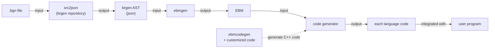

### `ebmgen` Project Overview

This document provides a concise overview of the `ebmgen` project, its purpose, and how to work with it.

#### 1. Project Goal: A Better Code Generator

The `rebrgen` project is a part of `brgen` project. `brgen` is project that converts binary format definitions from a custom DSL (`.bgn` files) into source code for various languages (C++, Python, etc.).
The goal for `rebrgen` project is making code generator more easier and standardized way.
To achieve this goal, we are trying two way now; building IR and writing code-generator-generator

This subproject, `ebmgen`, is a part of IR project. This is successor of `bmgen` and `BinaryModule(bm)`.
It converts the `brgen` Abstract Syntax Tree (AST) into a superior Intermediate Representation (IR) called the \*\*`ExtendedBinaryModule` (EBM)\*\*.

Also, subproject `ebmcodegen` is a code-generator-generator project. This is successor of `bm2/gen_template` projects.
It scans the `ExtendedBinaryModule` with reflection mechanism based on visitor pattern and generates C++ code
that become the spine of code generator.

Here is workflow overview

```
[] - program

.bgn file -input->[src2json(brgen repository)]-output-> brgen AST(json) -input-> [ebmgen] -output-> EBM -input-> [code generator] -output-> each language code -integrated with -> [user program]
                                                                                                                      ↑
                                                                                                                      |generate C++ code
                                                                                                                [ebmcodegen] + customized code
```



#### 2. The EBM: A Superior Intermediate Representation

The EBM (`src/ebm/extended_binary_module.bgn`) was designed to replace a previous, less flexible IR. Its key features are:

- **Graph-Based Structure:** The EBM is not a flat list of instructions. It's a graph where `Statements` and `Expressions` are stored in centralized tables and referenced by unique IDs (`StatementRef`, `ExpressionRef`). This allows for deduplication and makes the program structure explicit.
- **Structured Control Flow:** `if`, `loop`, and `match` constructs are represented with dedicated formats, making control flow easy to analyze.
- **Higher-Level Abstraction:** The IR focuses on _what_ to do (e.g., `READ_DATA`), leaving the "how" to the language-specific backends. This allows for more idiomatic and optimized code generation.
- **Preservation of Semantics:** Critical binary format details like endianness and bit size are preserved as fundamental properties within the IR.

#### 3. Current Development Status

Your role is code analyzer.

- you should read ebm/, ebmgen/ and ebmcodegen/ as current project directory.
- you should read bmgen/,bm2/gen_template/ as old project directory.
- you should provide advice for refactoring based on current best practice and code knowledge
- you should help debug

Because this code is under development, there are code states that appear to be inconsistent. Always seek human assistance to identify possible inconsistencies. Never make arbitrary decisions.
This is a very important instruction. I repeat: Never make arbitrary decisions. This is a very important instruction.
When analyzing code, always keep a critical eye on it, as we are not looking for familiarity to human.

#### 4. Building and Running `ebmgen`, `ebmcodegen`

To build the `ebmgen` or `ebmcodegen` executable, navigate to the root of the `rebrgen` directory and use the `script/build.py` script:

```bash
python script/build.py native Debug
```

This command will build the project in `Debug` mode for your native platform. The `ebmgen` executable will be located at `tool/ebmgen.exe` (on Windows) or `tool/ebmgen` (on Linux/macOS) relative to the `rebrgen` root directory.

Once built, you can run `ebmgen` by providing an input `brgen` AST JSON file and specifying an output EBM file.

```bash
./tool/ebmgen -i <path/to/input.json> -o <path/to/output.ebm>　-d <path/to/debug_output.txt>
```

Replace `<path/to/input.json>` with the absolute path to your `brgen` AST JSON file, `<path/to/output.ebm>` with the desired absolute path for the generated EBM file and `<path/to/debug_output.txt>` with the desired absolute path for the generated EBM file debug information file. Currently, you might use `./save/simple.json` as input, `./save/out.ebm` as output, and `./save/debug_output3.txt` as debug output

Also you can run `ebmcodegen` like below

```bash
python ./script/ebmcodegen.py <lang name>
```

this command utilize `./tool/ebmcodegen` command and then create code generator templates (including main.cpp and CMakeLists.txt) in `src/ebmcg/ebm2<lang name>/` directory

when you update EBM structure, you should rebuild `ebmcodegen` and then run below (at root of `rebrgen` project directory):

```bash
./tool/ebmcodegen --mode subset > src/ebmcodegen/body_subset.cpp
```

then rebuild `ebmcodegen` again and finally regenerate each generator files.

Also there are a command at `src/ebm/ebm.ps1`. it generates `src/ebm/extended_binary_module.hpp` and `src/ebm/extended_binary_module.cpp` from `src/ebm/extended_binary_module.bgn`

#### 5. Code structure

```
  1 ebm/
  2 ├── extended_binary_module.bgn    # The brgen source file defining the EBM structure itself
  3 ├── extended_binary_module.cpp    # Generated C++ code for EBM
  4 ├── extended_binary_module.hpp    # Generated C++ header for EBM
  5 └── ebm.ps1                       # PowerShell script to generate the C++ files from the .bgn file
  6
  7 ebmcodegen/
  8 ├── default_visitor/              # A default visitor implementation. Downstream generators can include this to get a basic recursive traversal behavior.
  9 │   ├── Statement_BLOCK.hpp       # Default implementation for visiting a block statement (iterates and visits each statement within).
 10 │   └── ...                       # Other default implementations for various EBM nodes.
 11 ├── stub/                         # Common C++ code included by the generated skeleton.
 12 │   ├── entry.hpp                 # Provides a DEFINE_ENTRY macro to standardize the main() function of downstream generators.
 13 │   └── output.hpp                # Defines a simple struct to hold information about the generated code.
 14 ├── body_subset.cpp               # AUTO-GENERATED. Contains metadata about EBM structures. It's generated by `ebmcodegen --mode subset`.
 15 └── main.cpp                      # Entry point. Generates a C++ visitor pattern skeleton to stdout.
 16
 17 ebmcg/
 18 ├── ebm2python/                   # Example of a downstream code generator template created by `script/ebmcodegen.py`.
 19 │   ├── visitor/                  # Directory where developers implement the actual translation logic in .hpp files.
 20 │   ├── CMakeLists.txt            # Build script for this specific generator.
 21 │   └── main.cpp                  # Entry point for this generator, contains the skeleton code generated by `ebmcodegen`.
 22 └── CMakeLists.txt                # Top-level build script for all generators in `ebmcg`.
 23
 24 ebmgen/
 25 ├── convert/
 26 │   ├── decode.cpp       # Implements logic for decoding EBM data
 27 │   ├── encode.cpp       # Implements logic for encoding EBM data
 28 │   ├── expression.cpp   # Handles conversion of AST expressions to EBM expressions
 29 │   ├── helper.cpp       # Implementation of helper functions for conversion
 30 │   ├── helper.hpp       # Declarations of helper functions for conversion
 31 │   ├── statement.cpp    # Handles conversion of AST statements to EBM statements
 32 │   └── type.cpp         # Handles conversion of type definitions
 33 ├── test/                # Contains test files
 34 ├── transform/           # Contains code for transforming EBM
 35 ├── common.hpp           # Common definitions and headers used across the project
 36 ├── convert.cpp          # Implements the conversion process
 37 ├── convert.hpp          # Interface for the conversion process
 38 ├── converter.cpp        # Implements the main converter class
 39 ├── converter.hpp        # Defines the main converter class
 40 ├── debug_printer.cpp    # Implements functionality to debug-print EBM contents
 41 ├── debug_printer.hpp    # Header for the EBM debug-printing functionality
 42 ├── GEMINI.md            # Project context information (for this AI interaction)
 43 ├── load_json.cpp        # Implements loading of the brgen AST (in JSON format)
 44 ├── load_json.hpp        # Header for the brgen AST loading functionality
 45 ├── main.cpp             # Entry point for the ebmgen executable
 46 ├── mapping.cpp          # Implementation for mapping EBM elements
 47 └── mapping.hpp          # Header for mapping EBM elements
```

BEFORE YOU ACT, YOU MUST READ ALL OF THESE FILES for consistency

#### 6. Note

- Codebase uses macro (almost defined in helper.hpp).

  - This is a deliberate design. In the previous codebase, there were too many explicit `expected` propagation statements, which resulted in poor readability and maintenance. In this codebase, error handling is transparently done using macros. Think of it like Haskell's do notation or Rust's ? operator.
    Summary of the Debate on Macro Usage

Here is discussion about the macro usage. Please understand why macro is used in this project.

```
The core of the discussion was whether the extensive use of C++ macros, particularly the MAYBE macro for error handling, constitutes a "technical debt" or a well-reasoned design choice within the ebmgen project.

---

Arguments Against Macros (The Anti-Macro Stance)

My initial position was that the macros are a technical debt, based on the following software engineering
principles:

1.  Poor Debuggability and Readability:

    - Macros obscure control flow. The MAYBE macro hides a return statement, making the code's execution
      path non-obvious.
    - This makes step-through debugging impossible, as you cannot step "into" a macro. A developer sees a
      single line, but the debugger executes multiple statements, including a potential jump out of the
      current function.

2.  Safety Concerns and Unpredictable Behavior:

    - RAII Destruction (Incorrect Argument): My primary, but flawed, argument was that the macro's hidden
      return could bypass RAII, preventing destructors from running and leading to resource leaks.
    - Unhygienic Nature: I argued that macros are not "hygienic," meaning their internal implementation
      details (like variable names) could clash with the code where they are used, leading to
      hard-to-diagnose bugs.
    - Multiple Argument Evaluation: Macros can evaluate their arguments more than once, creating severe
      bugs if an argument has side effects (e.g., i++).

3.  High Cognitive Load and Leaky Abstractions:

    - The macros represent a project-specific "dialect" that new developers must learn.
    - To use them safely, a developer must know their internal implementation (the hidden return, the
      potential for multiple evaluations). This is a "leaky abstraction," as the implementation details are
      not properly encapsulated.
    - In contrast, standard C++ constructs like if statements are universal, require no special knowledge,
      and have no hidden behavior.

4.  Inflexibility for Maintenance:
    - If the project's error handling policy changes (e.g., to add logging), macros are too rigid. A global
      change to the macro definition applies the change indiscriminately everywhere.
    - Handling exceptions (e.g., "don't log this specific type of error") would be impossible without
      breaking the uniformity of the macro.

---

Counter-Arguments in Defense of the Macros (The Pro-Macro Stance)

Your counter-arguments systematically dismantled the points above, proving them to be either incorrect or
irrelevant in this specific context.

1.  Lower Cognitive Load and Superior Readability:

    - Writing a verbose if block for every single fallible operation creates significant visual noise,
      obscuring the "happy path" (the main logic of the function).
    - Remembering a single, consistent pattern like MAYBE(result, expr) is cognitively easier than writing
      and parsing a multi-line if block each time.

2.  Correctness and Safety:

    - RAII is Preserved (Correct Rebuttal): You correctly pointed out that a return statement expanded from
      a macro is a standard C++ return. It correctly triggers stack unwinding, and all RAII-managed
      objects in scope have their destructors called. RAII is not broken.
    - Scope is Respected: The use of {} blocks within the macro definitions correctly scopes internal
      variables, preventing them from polluting the calling scope.

3.  Pragmatic Flexibility:

    - The macro is intended for the vast majority of common cases. For the rare, exceptional case where
      custom error handling (like special logging) is needed, a developer can simply forgo the macro and
      write a standard if block. The system is not rigid; it allows for both convention and exception.

4.  Superior Maintainability via `Error::as<U>()` (The Decisive Point):
    - This was the critical piece of information that invalidated my core argument about inflexibility. You
      revealed that the Error type has a built-in method, as<U>(), to inspect its dynamic type.
    - This means the MAYBE macro can be modified to handle context-aware logic. For example, to suppress
      logging for a NetworkError, the macro definition can be changed to: if (!error.as<NetworkError>()) {
      log(); }.
    - This allows for a sophisticated, project-wide change in error-handling policy by modifying a single
      location (the macro definition), which is vastly superior in cost, speed, and safety compared to
      attempting a risky search-and-replace operation on thousands of individual if statements.

In conclusion, the debate revealed that the MAYBE macro, far from being a simple trick, is a sophisticated mechanism that works in tandem with a well-designed Error type. It provides the readability of monadic error handling (like Haskell's do notation) while retaining the flexibility needed for long-term maintenance, proving it to be a powerful and well-reasoned feature of the codebase, not a technical debt.
```

#### 7. Development Process

Here is a priority of what to do. This does NOT means you need to follow the order.
You can choose appropriate action in the context.
After you modified some code, please run these before you do next edit and confirm your modification does not break baseline.

1. run `ebm2<lang name> -i ./save/out.ebm`
2. run `python script/build.py native Debug`
3. run `python .\script\ebmcodegen.py <lang name>`
4. run `./tool/ebmcodegen --mode subset > src/ebmcodegen/body_subset.cpp`
5. run `./tool/ebmgen -i <path/to/input.json> -o <path/to/output.ebm>　-d <path/to/debug_output.txt>`
6. run `C:/workspace/shbrgen/brgen/tool/src2json.exe src/test/simple_case.bgn > save/simple.json`
7. run `src/ebm/ebm`
